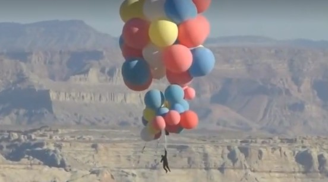

**Полет на шариках: Дэвид Блейн повторил трюк из мультфильма «Вверх»**

Американский иллюзионист Дэвид Блейн исполнил опасный для жизни трюк под названием **«Вознесение»**. Он совершил часовой полет над Аризонской пустыней, держась за связку из 52 воздушных шаров и поднявшись на высоту около 7,6 км.

Вдохновившись **мультфильмом «Вверх»,** он впервые за десять лет совершил опасный для жизни трюк — «Вознесение» («Ascension»). По словам иллюзиониста, на сегодняшний день часовой полет над Аризонской пустыней является его «самым амбициозным и грандиозным подвигом».

_«Каждый трюк, который я когда-либо делал, связан с выносливостью и преодолением того, что, как я думал, было бы возможным, — сказал Блейн в видео перед полетом. — Но я не могу представить, что многие люди могли бы об этом мечтать»._

Полет полностью транслировался на YouTube-канале иллюзиониста — зрители могли отследить перформанс от подготовки до приземления. Менее чем за сутки запись трансляции трюка посмотрели более 6,3 млн раз. На пике за геройствами американца следили около 770 тыс. человек — это рекорд видеоплатформы.

Несмотря на то, что изначально каскадер ставил цель достичь высоты около 18 тыс. футов, в итоге он поднялся на 24,9 тыс. футов (около 7,6 км), прежде чем прыгнуть с парашютом. Чтобы помочь шарам подняться, он сбрасывал грузы и, достигнув нужной высоты, отпустил связку.

_«Вот это да! — воскликнул он после приземления. — Это было потрясающе»._

В течение нескольких лет до перформанса Блейн проходил серьезную подготовку, оттачивая физическую форму и технику дыхания для обеспечения правильного уровня кислорода на высоте. Ради «Вознесения» он совершил около 500 прыжков с парашютом и получил права на управление воздушным шаром. По словам Блейна, ему хотелось, чтобы со стороны это выглядело просто — будто он, как в детских сказках, взялся рукой за связку шаров и полетел.

Визуально спуск артиста от свободного падения к натяжению веревки на парашюте действительно выглядел легко и гладко — ему удалось воспарить над пустыней без резких движений и рывков. Единственной шероховатостью оказалось то, что Блейн не сумел волшебным образом появиться в целевой точке приземления, но все же сымпровизировал и благополучно приземлился неподалеку.

Прошлым перформансом Блейна, который транслировался на YouTube, был проект **«Electrified: One Million Volts Always»** («Электрифицировано: 1 млн вольт») в 2012 году. В течение 72 часов иллюзионист простоял на колонне высотой около шести метров в окружении семи катушек Теслы, непрерывно производящих электрический разряд в 1 млн вольт или более. Катушки были направлены на Блейна на протяжении всего трюка, во время которого он не ел и не спал. Иллюзионист был одет в экипировку весом в 15 кг для предотвращения прохождения электрического тока через тело. Ночью Блейн сильно дрожал от ненастной погоды.

Мероприятие завершилось **8 октября 2012 года.** Иллюзионисту помогли спуститься и доставили в больницу для медицинского осмотра. Две катушки Теслы, которые использовались в перформансе, Блейн подарил для постоянной экспозиции Центру науки Свободы в Джерси-Сити, штат Нью-Джерси.

